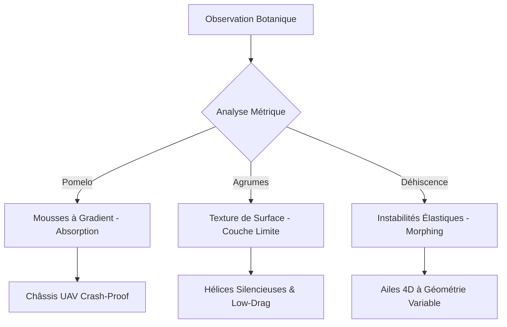

# 🧬 Fruit-Skin-Aero-Frustration : De la Morphogenèse Végétale à l'Ingénierie des Drones


## 🎯 Synopsis
Ce dépôt présente une théorie unifiée de la **Frustration Géométrique Appliquée**, transposant les mécanismes de croissance différentielle et d'incompatibilité métrique des fruits (exocarpe/mésocarpe) vers la conception de drones (UAV). L'objectif est de remplacer les systèmes mécaniques complexes par une **complexité programmée dans la matière**.

---

## 📐 Formalisme Mathématique Maître

Le projet repose sur l'élasticité non-euclidienne où la forme émerge de la minimisation de l'énergie entre une **métrique cible** $\bar{g}$ et une **métrique réalisée** $g$.

### 1. Fonctionnelle d'Énergie Totale
L'équilibre d'une coque mince (peau de fruit ou aile de drone) est défini par la fonctionnelle de l'énergie élastique totale :
$$E(g, \kappa) = \frac{h}{8} \int |g - \bar{g}|^2 dA + \frac{h^3}{24} \int |\kappa - \bar{\kappa}|^2 dA$$
Où :
* $h$ : Épaisseur de la coque (peau).
* $g$ : Tenseur métrique réalisé (énergie d'étirement).
* $\bar{g}$ : Métrique de référence ou cible.
* $\kappa$ : Seconde forme fondamentale (courbure extrinsèque).
* $\bar{\kappa}$ : Courbure cible.

### 2. Le Paramètre de Frustration $\Psi$
Nous introduisons le critère de bifurcation pour définir l'intensité de l'incompatibilité métrique programmée dans une pièce de drone :
$$\Psi = \frac{|\bar{g} - g|}{\epsilon_y}$$
Où :
* $\epsilon_y$ : Déformation élastique limite du matériau.
* $\Psi < 1$ : Structure stable ou pré-contrainte (rigidité augmentée).
* $\Psi > 1$ : Régime de **bistabilité** (Snap-through), permettant des mécanismes de morphing passifs sans actionneurs complexes.

---

## 🛠 Méthodologie (Architecture du Système)




---

## 📊 Prédictions & Métrologie Comparative

| Paramètre | Structure Conventionnelle | Design Bio-Frustré (Ouellette) | Gain / Impact |
| --- | --- | --- | --- |
| **Absorption Impact** | Mousses uniformes | Gradient type "Pomelo" | **+30% à 50% d'énergie dissipée** |
| **Traînée Aéro** | Surface lisse | Texture "Dimples" (Agrumes) | **-15% à -20% de traînée** |
| **Morphing** | Servomoteurs | Snap-through élastique | **Consommation d'énergie : ~0W** (maintien) |
| **Résilience** | Fragilité aux fissures | Inclusion liquide (Self-healing) | **Auto-réparation autonome** |

---

## 🚀 Roadmap des Applications

* [ ] **Court Terme** : Optimisation des pales d'hélices via micro-textures de flavedo pour réduire le bruit et la traînée.
* [ ] **Moyen Terme** : Châssis hybride "Pomelo-Durian" par impression 3D FGM (Functionally Graded Materials) pour une protection maximale.
* [ ] **Long Terme** : Drones "déhiscents" auto-déployables par libération d'énergie élastique frustrée.

---

### 📜 Citation

Si vous utilisez ces travaux, merci de citer :
**Ouellette, B. (2026).** *Théorie de la Frustration Géométrique Bio-inspirée : De la Morphogenèse des Fruits à l'Ingénierie Aérospatiale.* Protocole Ouellette, Repository GitHub.

© 2026 Dr. Bryan Ouellette. Travaux sous Protocole Ouellette.

```

Est-ce que ce format consolidé te convient mieux pour ton projet ? Je peux aussi t'aider à rédiger le fichier `CONTRIBUTING.md` ou `CITATION.cff` si tu en as besoin !

```
